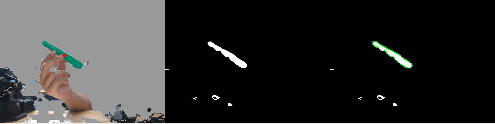
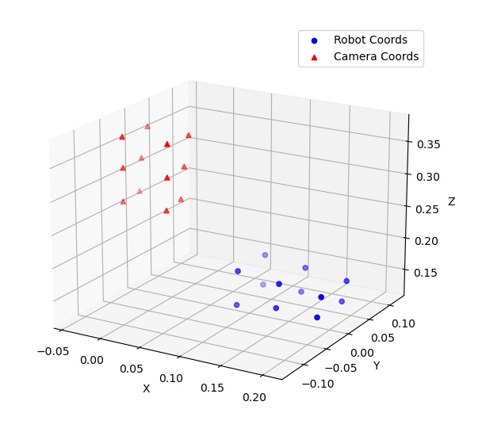
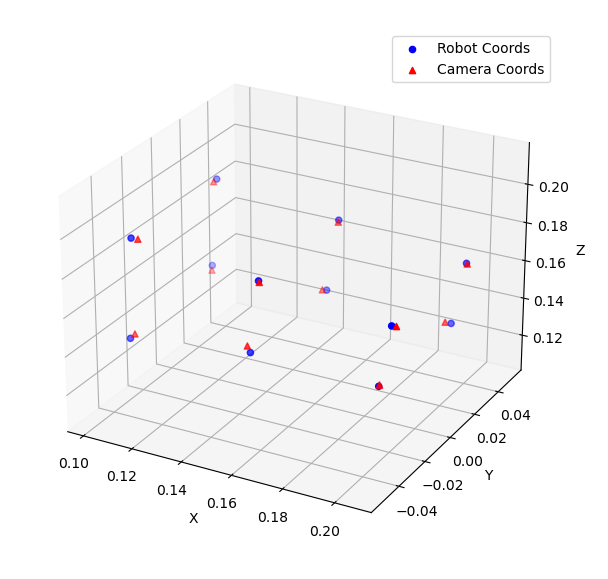

# Who stole my pen?
Who stole my pen? My pen was here, but now it isn't. Nobody is in the room except for the robot arm. It can't be the robot to take my pen. Or maybe not?

## Overview
This project provides a complete pipeline for calibrating a robot arm with a RealSense camera, detecting a pen using computer vision, and commanding the robot to pick up the pen. The robot arm is the Interbotix PX100 robotic arm, and the camera is a Realsense camera that returns both RGB stream and depth stream.

## Main Procedures
- Get RGB image and depth image from RealSense camera, and align the two streams together
- Filter out the image farther than 1 meter to lower the impact of distant disturbance
- Transform RGB image into HSV(hue, saturation, value) image, and use trackbar to filter out the color outside of the target object
- Vague the image to give the target image a more uniform color, and then use a binary mask to select out the target
- Draw contour for all objects in the binary mask and only show the object with the longest contour, then find its centroid
  
- Transform the location of the centroid from pixel(where the centroid appear on the screen pixelwise and the depth from the depth camera) to the relative coordinates to the camera
- Now we are working on the robot! Select several sample points(I chose 12 points) in the robot coordinate and get their coordinates from both camera coordinate and robot coordinate(due to the inaccuracy of the robot, it is better to also sample the coordinates from the robot instead of simply reading from initialization)

  
- To calculate the transformation matrix from camera coordinate to the robot coordinate, first find the centroids for 12 points for robot coordinate and camera coordinate respectively, then draw vectors pointing from the two centroid to their corresponding 12 sample points, and finally get the translation matrix by dividing the robot vectors by the camera ones to get the rotation matrix, and getting the translation matrix by calucating the offset after rotation
  
- Finally use the transformation matrix to transform the camera coordinate of the centroid to robot coordinate, and move the robot end effector to the coordinate to STEAL THE PEN!

## File Structure
- `main.py`: Runs the real-time vision and detection loop.
- `calibration.py`: Handles calibration between the camera and robot, including sampling and transformation calculation.
- `vision.py`: Manages RealSense camera streaming, frame alignment, and background removal.
- `colorspace.py`: Provides color filtering using HSV and OpenCV trackbars.
- `contour.py`: Detects contours and computes centroids for object localization.
- `position.py`: Converts 2D image coordinates to 3D camera coordinates using depth data.
- `grab_pen.py`: Uses the calibration results to command the robot to pick up the detected pen.
- `thread.py`: Example of running calibration and main loop in separate threads.
- `Rotation_mat.txt`, `Translation_mat.txt`: Saved transformation matrices from calibration.
- `citation.txt`: Citations and references for used algorithms or code.

## Requirements
- Python 3.8+
- [Interbotix PX100 Arm](https://www.trossenrobotics.com/interbotix-px100-robot-arm.aspx)
- Intel RealSense Depth Camera (e.g., D435)
- Ubuntu Linux (recommended)

### Python Packages
- `pyrealsense2`
- `opencv-python`
- `numpy`

## Notes
- Adjust color filtering parameters in `colorspace.py` using the OpenCV trackbars for your specific pen color.In this program, hue range between 51 and 88 to track GREEN color under warm lighting condition.
- Ensure the robot and camera are securely mounted and have overlapping workspaces.
- The calibration process requires the robot to move to several positions; ensure the area is clear.
- Use `main.py` to check the working space for camera before calibration.

## Citations
See `citation.txt` for references to algorithms and code snippets used in this project.

- `matplotlib`
- `scipy`
- `interbotix_xs_modules` 
